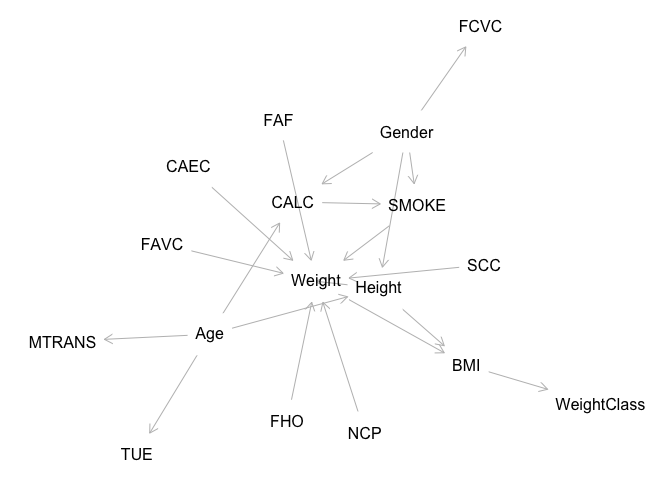
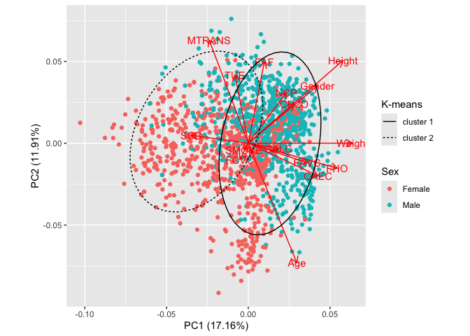
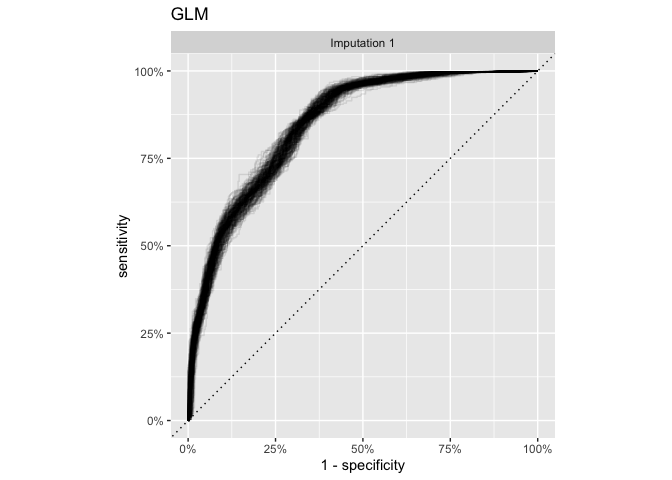
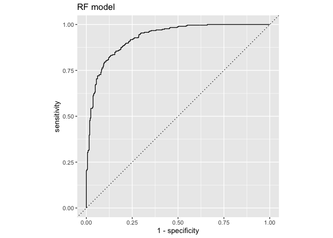
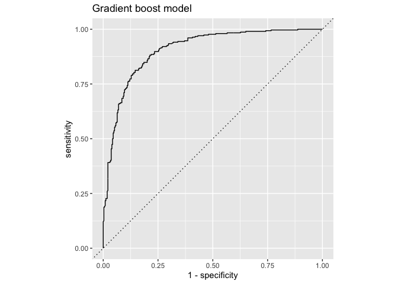
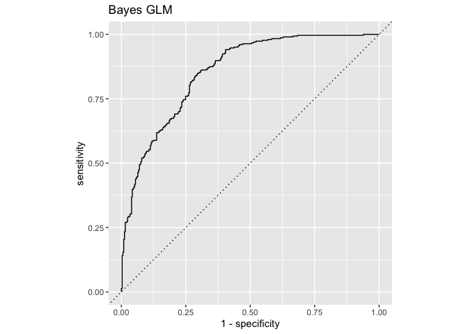

# Problems

``` r
library(tidyverse)
library(here)
library(mice)
library(skimr)
library(brms)
library(yardstick)
library(tidybayes)
library(tidymodels)
library(broom.mixed)
library(ggfortify)
```

## 1. Write bash script to split data into separate files based on gender and weight class.

``` bash
bash scripts/split.sh data/obesity.data.txt
```

    Wrote 1044 lines to output/Gender_female.tsv
    Wrote 1069 lines to output/Gender_male.tsv
    Wrote 272 lines to output/WeightClass_under_weight.tsv
    Wrote 287 lines to output/WeightClass_normal.tsv
    Wrote 580 lines to output/WeightClass_overweight.tsv
    Wrote 972 lines to output/WeightClass_obese.tsv

## 2. Impute missing data.

### Importing original dataset

``` r
col_types <- cols(
  Gender = col_character(),
  Age = col_double(),
  Height = col_double(),
  Weight = col_double(),
  FHO = col_character(),
  FAVC = col_character(),
  FCVC = col_double(),
  NCP = col_double(),
  CAEC = col_character(),
  SMOKE = col_character(),
  CH2O = col_double(),
  SCC = col_character(),
  FAF = col_double(),
  TUE = col_double(),
  CALC = col_character(),
  MTRANS = col_character(),
  WeightClass = col_double()
)
obesity <- read_tsv(here("data/obesity.data.txt"), col_types = col_types)
```

Let’s have a look at the data:

- Most variables miss ~30% of observations,
- Gender ja WeightClass are 100% complete,
- Categorical variables Gender, FHO, FAVC, SMOKE, SCC are binary

``` r
skim(obesity)
```

    ── Data Summary ────────────────────────
                               Values 
    Name                       obesity
    Number of rows             2111   
    Number of columns          17     
    _______________________           
    Column type frequency:            
      character                8      
      numeric                  9      
    ________________________          
    Group variables            None   

    ── Variable type: character ────────────────────────────────────────────────────
      skim_variable n_missing complete_rate min max empty n_unique whitespace
    1 Gender                0         1       4   6     0        2          0
    2 FHO                 628         0.703   2   3     0        2          0
    3 FAVC                546         0.741   2   3     0        2          0
    4 CAEC                653         0.691   2  10     0        4          0
    5 SMOKE               502         0.762   2   3     0        2          0
    6 SCC                 636         0.699   2   3     0        2          0
    7 CALC                501         0.763   2  10     0        4          0
    8 MTRANS              609         0.712   4  21     0        5          0

    ── Variable type: numeric ──────────────────────────────────────────────────────
      skim_variable n_missing complete_rate   mean      sd    p0    p25    p50
    1 Age                 538         0.745 24.3    6.28   14    19.9   22.7  
    2 Height              646         0.694  1.70   0.0931  1.45  1.63   1.70 
    3 Weight              597         0.717 86.4   26.5    39    65.2   82.4  
    4 FCVC                435         0.794  2.42   0.535   1     2      2.35 
    5 NCP                 479         0.773  2.69   0.779   1     2.69   3    
    6 CH2O                569         0.730  2.01   0.608   1     1.59   2    
    7 FAF                 607         0.712  1.02   0.853   0     0.144  1    
    8 TUE                 575         0.728  0.651  0.603   0     0      0.619
    9 WeightClass           0         1      3.07   1.05    1     2      3    
         p75   p100 hist 
    1  26     55.1  ▇▆▂▁▁
    2   1.77   1.98 ▂▆▇▅▁
    3 107.   173    ▆▇▆▂▁
    4   3      3    ▁▁▇▂▇
    5   3      4    ▂▁▁▇▁
    6   2.47   3    ▅▂▇▂▅
    7   1.68   3    ▇▆▃▃▂
    8   1      2    ▇▃▅▁▂
    9   4      4    ▂▂▁▅▇

### Transform data

- let’s code response WeightClass as binary variable obese == 1,
- there is one observation with CALC==“Always”, we change this to
  “Frequently” to keep things sane (otherwise it will break things up
  down the road, as one way or another way we may end up predicting new
  levels),
- transform categorical variables with two levels to binary no == 0 ja
  Female == 0,
- remaining categorical variables converting to factors, as mice likes
  factors,
- center and standardize Age, Height, Weight and numeric categories by
  using fixed values, so that they can be used independently on train
  and test sets

``` r
obesity_trans <- obesity %>% 
  mutate(
    obese = case_when(
    is.na(WeightClass) ~ NA, 
    WeightClass == 4 ~ 1,
    TRUE ~ 0
  ),
  Gender = case_when(is.na(Gender) ~ NA, Gender == "Female" ~ 0, TRUE ~ 1),
  CALC = if_else(CALC == "Always", "Frequently", CALC),
  Age = (Age - 40) / 10,
  Height = (Height - 1.7) / 0.1,
  Weight = (Weight - 80) / 10,
  id = row_number() # setup id for splitting and reshaping
  ) %>% 
  mutate_at(vars(FHO, FAVC, SMOKE, SCC), ~case_when(is.na(.x) ~ NA, .x == "no" ~ 0, TRUE ~ 1)) %>% 
  mutate_at(vars(FCVC, NCP, CH2O, FAF, TUE), ~.x / 4) %>% 
  mutate_if(is.character, as.factor)

obesity_trans %>% 
  write_csv(here("output/obesity_trans.csv"))
```

### Split data to train and test set

``` r
set.seed(184)
train <- obesity_trans %>% 
  sample_frac(0.7)
test <- obesity_trans %>% 
  anti_join(train, by = "id")
```

### Imputation

Just to visualize my knowledge of the variables, let’s create a graph.

Notably:  
- Obesity is defined by BMI\>30 and BMI of cause is calculated as
$kg/m^2$. - WeightClass is determined by the body weight and height.

Let’s include weight and height for imputations, as we want to get as
good/realistic dataset as possible, but keep only demographic,
lifestyle, etc. parameters for prediction.

``` r
library(dagitty)
g1 <- dagitty("dag {
    BMI -> WeightClass
    Weight -> BMI <- Height
    Age -> Height -> Weight
    Gender -> Height
    Gender -> SMOKE
    Gender -> FCVC
    FHO -> Weight
    FAVC -> Weight
    NCP -> Weight
    CAEC -> Weight
    SCC -> Weight
    FAF -> Weight
    Age -> MTRANS
    Gender -> CALC
    Age -> CALC
    Age -> TUE
    SMOKE -> Weight
    CALC -> SMOKE
}")
plot(graphLayout(g1))
```



Let’s use `mice` package to impute missing values using following
methods:

``` r
method <- c(
  Gender = "", 
  Age = "norm",
  Height = "norm",
  Weight = "norm",
  FHO = "logreg",
  FAVC = "logreg",
  FCVC = "norm",        
  NCP = "norm",
  CAEC = "polyreg", 
  SMOKE = "logreg", 
  CH2O = "norm", 
  SCC = "logreg", 
  FAF = "norm",
  TUE = "norm",
  CALC = "polyreg",
  MTRANS = "polyreg",
  WeightClass = "",
  obese = "",
  id = ""
  )
```

We perform five (5) imputations

``` r
set.seed(11)
imp_train <- mice(train, m = 5, method = method, print = FALSE)
```

## 3. Perform cluster analyses: do samples cluster by sex/Gender?

Pulling out first imputed dataset

``` r
(imp_train_df <- complete(imp_train) %>% as_tibble())
```

    # A tibble: 1,478 × 19
       Gender    Age  Height Weight   FHO  FAVC  FCVC   NCP CAEC   SMOKE  CH2O   SCC
        <dbl>  <dbl>   <dbl>  <dbl> <dbl> <dbl> <dbl> <dbl> <fct>  <dbl> <dbl> <dbl>
     1      0 -1.6   -0.500  -2         1     0 0.5   0.75  Somet…     0 0.75      0
     2      0 -1.86  -0.244   4.16      1     1 0.75  0.75  Somet…     0 0.371     0
     3      1 -1.7    0.537   2.65      1     1 0.685 0.633 Somet…     0 0.520     0
     4      1 -2.62   0.167  -2.89      1     0 0.602 0.75  Somet…     0 0.319     0
     5      0 -2.20  -0.500   0.421     1     1 0.715 0.75  Somet…     0 0.25      0
     6      0 -2.3   -1.7    -2.5       1     1 0.5   0.75  Somet…     0 0.25      0
     7      1 -2.23   0.400  -2.88      0     1 0.513 0.661 Somet…     0 0.589     0
     8      0 -0.369  0.0140  0.3       1     1 0.564 0.756 Somet…     0 0.5       0
     9      0 -1.82  -1.00   -1.60      1     1 0.527 0.75  Somet…     0 0.527     0
    10      1 -2      2.8     4.5       1     1 0.5   0.75  Always     0 0.75      0
    # ℹ 1,468 more rows
    # ℹ 7 more variables: FAF <dbl>, TUE <dbl>, CALC <fct>, MTRANS <fct>,
    #   WeightClass <dbl>, obese <dbl>, id <int>

Transform categorical variables to numeric categories

``` r
ob <- imp_train_df %>% 
  select(-id, -obese, -WeightClass) %>% 
  mutate_if(is.factor, as.numeric)
```

#### PCA + k-means

``` r
pca <- prcomp(ob, scale. = TRUE)
kclusts <- kmeans(scale(ob), centers = 2, nstart = 20)
```

PCA of obesity data overlaid with k-means (k=2) clusters. No clustering
accoring to sex.

``` r
ob$cluster <- kclusts$cluster
autoplot(
  pca, 
  data = ob %>% mutate_at(c("Gender", "cluster"), as.factor), 
  loadings = TRUE, 
  loadings.label = TRUE,
  color = "Gender") +
  coord_equal() +
  stat_ellipse(aes(linetype = factor(cluster))) +
  scale_color_discrete("Sex", labels = c("Female", "Male")) +
  scale_linetype_discrete("K-means", labels = c("cluster 1", "cluster 2"))
```



## 4. Train a suitable machine learning tool to predict obesity using the dataset and describe performance of the trained model.

### Model fitting

Multiple-imputed datasets can be used to fit Stan models using `brms`
package.

``` r
fit_imp1 <- brm_multiple(
  obese ~ Gender + Age + FHO + FAVC + FCVC + NCP + CAEC + SMOKE + CH2O + SCC + FAF + TUE + CALC + MTRANS, 
  data = imp_train, 
  family = "bernoulli",
  prior = prior(normal(0, 1), class = "b"),
  combine = TRUE,
  file = here("output/fit_imp1"),
  file_refit = "always"
  )
```

``` r
summary(fit_imp1)
```

     Family: bernoulli 
      Links: mu = logit 
    Formula: obese ~ Gender + Age + FHO + FAVC + FCVC + NCP + CAEC + SMOKE + CH2O + SCC + FAF + TUE + CALC + MTRANS 
       Data: imp_train (Number of observations: 1478) 
      Draws: 20 chains, each with iter = 2000; warmup = 1000; thin = 1;
             total post-warmup draws = 20000

    Population-Level Effects: 
                                Estimate Est.Error l-95% CI u-95% CI Rhat Bulk_ESS
    Intercept                      -7.60      0.82    -9.23    -6.04 1.07      164
    Gender                         -0.12      0.16    -0.43     0.18 1.11      111
    Age                             0.88      0.18     0.56     1.27 1.29       51
    FHO                             2.57      0.40     1.88     3.43 1.29       51
    FAVC                            1.84      0.28     1.29     2.40 1.07      161
    FCVC                            2.90      0.51     1.91     3.91 1.06      191
    NCP                             0.31      0.36    -0.40     1.01 1.04      322
    CAECFrequently                 -1.21      0.49    -2.16    -0.25 1.01     2393
    CAECno                         -0.41      0.77    -1.93     1.04 1.12      101
    CAECSometimes                   1.45      0.43     0.63     2.32 1.09      137
    SMOKE                          -0.56      0.48    -1.51     0.38 1.07      163
    CH2O                            0.90      0.47    -0.04     1.81 1.13       99
    SCC                            -1.37      0.48    -2.32    -0.45 1.14       90
    FAF                            -0.51      0.37    -1.23     0.20 1.18       75
    TUE                            -0.99      0.48    -1.93    -0.05 1.15       84
    CALCno                          0.35      0.46    -0.52     1.26 1.27       54
    CALCSometimes                   0.69      0.49    -0.21     1.69 1.38       43
    MTRANSBike                      0.23      0.85    -1.49     1.86 1.09      133
    MTRANSMotorbike                 1.61      0.77     0.04     3.06 1.05      245
    MTRANSPublic_Transportation     1.35      0.29     0.82     1.95 1.41       41
    MTRANSWalking                  -0.74      0.58    -1.91     0.37 1.13       95
                                Tail_ESS
    Intercept                       1412
    Gender                           407
    Age                              126
    FHO                              151
    FAVC                            1242
    FCVC                            1425
    NCP                             1993
    CAECFrequently                 14265
    CAECno                           616
    CAECSometimes                    640
    SMOKE                            733
    CH2O                             312
    SCC                              585
    FAF                              386
    TUE                              572
    CALCno                           283
    CALCSometimes                    174
    MTRANSBike                       749
    MTRANSMotorbike                 1084
    MTRANSPublic_Transportation      146
    MTRANSWalking                    278

    Draws were sampled using sampling(NUTS). For each parameter, Bulk_ESS
    and Tail_ESS are effective sample size measures, and Rhat is the potential
    scale reduction factor on split chains (at convergence, Rhat = 1).

Rhats are large, but visual evaluation of density and trace plots (not
shown as it’s extensive and has diagnostic purpose) of MCMC draws
indicate that model has nicely converged.

``` r
plot(fit_imp1, ask = FALSE)
```

Despite warnings, all sub-models fitted to 5 separate imputations have
nicely converged

``` r
round(fit_imp1$rhats, 2)
```

      b_Intercept b_Gender b_Age b_FHO b_FAVC b_FCVC b_NCP b_CAECFrequently
    1           1        1     1     1      1      1     1                1
    2           1        1     1     1      1      1     1                1
    3           1        1     1     1      1      1     1                1
    4           1        1     1     1      1      1     1                1
    5           1        1     1     1      1      1     1                1
      b_CAECno b_CAECSometimes b_SMOKE b_CH2O b_SCC b_FAF b_TUE b_CALCno
    1        1               1       1   1.01     1     1     1        1
    2        1               1       1   1.00     1     1     1        1
    3        1               1       1   1.00     1     1     1        1
    4        1               1       1   1.00     1     1     1        1
    5        1               1       1   1.00     1     1     1        1
      b_CALCSometimes b_MTRANSBike b_MTRANSMotorbike b_MTRANSPublic_Transportation
    1               1            1                 1                             1
    2               1            1                 1                             1
    3               1            1                 1                             1
    4               1            1                 1                             1
    5               1            1                 1                             1
      b_MTRANSWalking lprior lp__
    1               1      1    1
    2               1      1    1
    3               1      1    1
    4               1      1    1
    5               1      1    1

### Testing model predictive performance

Imputing previously created test data

``` r
set.seed(56)
imp_test <- mice(test, m = 1, method = method, print = FALSE)
imp_test_list <- complete(imp_test, "all")
```

Generating ROC curve for each posterior draw

``` r
get_roc_values <- function(newdata, object, ...) {
  resp_var <- formula(object)[["formula"]][[2]]
  resp_var <- enquo(resp_var)
  add_epred_draws(newdata, object, ...) %>% 
    ungroup() %>% 
    mutate(!!resp_var := as.factor(!!resp_var)) %>% 
    split(.$.draw) %>%
    map_dfr(~roc_curve(., truth = !!resp_var, .epred, event_level = "second"), .id = ".draw") 
}
```

``` r
roc_vals <- imp_test_list %>% 
  map(~get_roc_values(.x, object = fit_imp1, ndraws = 200)) %>% 
  bind_rows(.id = "imputation")
```

Lets print out ROC curve only the first imputation.

``` r
roc_vals %>% 
  filter(imputation == 1) %>% 
  ggplot(aes(1 - specificity, sensitivity, group = .draw)) +
  geom_path(alpha = 0.1) +
  geom_abline(lty = 3) +
  facet_wrap(~str_c("Imputation ", imputation)) +
  scale_x_continuous(labels = scales::percent) +
  scale_y_continuous(labels = scales::percent) +
  coord_equal() +
  labs(title = "GLM")
```



``` r
imp_test_list[[1]] %>% 
  add_epred_draws(fit_imp1, newdata = ., ndraws = 200) %>% 
  group_by(.draw) %>% 
  nest() %>% 
  mutate(
    data = map(data, mutate_at, "obese", as.factor),
    roc_auc = map(data, ~roc_auc(.x, obese, .epred, event_level = "second"))
    ) %>% 
  select(.draw, roc_auc) %>% 
  unnest(roc_auc) %>% 
  ungroup() %>% 
  mean_hdi(.estimate)
```

    # A tibble: 1 × 6
      .estimate .lower .upper .width .point .interval
          <dbl>  <dbl>  <dbl>  <dbl> <chr>  <chr>    
    1     0.847  0.833  0.858   0.95 mean   hdi      

``` r
imp_test_list[[1]] %>% 
  predicted_draws(fit_imp1, newdata = ., ndraws = 200) %>% 
  group_by(.draw) %>% 
  summarise(accuracy = mean(obese == .prediction)) %>% 
  mean_hdi(accuracy)
```

    # A tibble: 1 × 6
      accuracy .lower .upper .width .point .interval
         <dbl>  <dbl>  <dbl>  <dbl> <chr>  <chr>    
    1    0.687  0.648  0.717   0.95 mean   hdi      

#### Random forest model

Fitting RF model

``` r
rf_mod <- 
  rand_forest(trees = 1000) %>% 
  set_engine("ranger") %>% 
  set_mode("classification")
rf_fit <- 
  rf_mod %>% 
  fit(
    obese ~ Gender + Age + FHO + FAVC + FCVC + NCP + CAEC + SMOKE + CH2O + SCC + FAF + TUE + CALC + MTRANS, 
    data = imp_train_df
  )
print(rf_fit, digits = 5)
```

    parsnip model object

    Ranger result

    Call:
     ranger::ranger(x = maybe_data_frame(x), y = y, num.trees = ~1000,      num.threads = 1, verbose = FALSE, seed = sample.int(10^5,          1), probability = TRUE) 

    Type:                             Probability estimation 
    Number of trees:                  1000 
    Sample size:                      1478 
    Number of independent variables:  14 
    Mtry:                             3 
    Target node size:                 10 
    Variable importance mode:         none 
    Splitrule:                        gini 
    OOB prediction error (Brier s.):  0.1245255 

RF model performance with trainingset using 10-fold cross validation

``` r
rf_wf <- 
  workflow() %>%
  add_model(rf_mod) %>%
  add_formula(obese ~ Gender + Age + FHO + FAVC + FCVC + NCP + CAEC + SMOKE + CH2O + SCC + FAF + TUE + CALC + MTRANS)

# generate cv folds
set.seed(345)
folds <- vfold_cv(imp_train_df, v = 10)
folds
```

    #  10-fold cross-validation 
    # A tibble: 10 × 2
       splits             id    
       <list>             <chr> 
     1 <split [1330/148]> Fold01
     2 <split [1330/148]> Fold02
     3 <split [1330/148]> Fold03
     4 <split [1330/148]> Fold04
     5 <split [1330/148]> Fold05
     6 <split [1330/148]> Fold06
     7 <split [1330/148]> Fold07
     8 <split [1330/148]> Fold08
     9 <split [1331/147]> Fold09
    10 <split [1331/147]> Fold10

Refit model to trainset cv folds

``` r
set.seed(456)
rf_fit_rs <- 
  rf_wf %>% 
  fit_resamples(folds)
collect_metrics(rf_fit_rs)
```

    # A tibble: 3 × 6
      .metric     .estimator  mean     n std_err .config             
      <chr>       <chr>      <dbl> <int>   <dbl> <chr>               
    1 accuracy    binary     0.819    10 0.0110  Preprocessor1_Model1
    2 brier_class binary     0.126    10 0.00358 Preprocessor1_Model1
    3 roc_auc     binary     0.910    10 0.00764 Preprocessor1_Model1

RF model performance with the test set.

``` r
rf_test_pred <- 
  predict(rf_fit, imp_test_df) %>% 
  bind_cols(predict(rf_fit, imp_test_df, type = "prob")) %>% 
  bind_cols(imp_test_df %>% 
              select(obese))
```

``` r
rf_test_pred %>%  
  roc_curve(truth = obese, .pred_1, event_level = "second") %>% 
  ggplot(aes(x = 1 - specificity, y = sensitivity)) +
  geom_path() +
  geom_abline(lty = 3) +
  coord_equal() +
  labs(title = "RF model")
```



- ROC AUC

``` r
rf_test_pred %>%                
  roc_auc(truth = obese, .pred_1, event_level = "second")
```

    # A tibble: 1 × 3
      .metric .estimator .estimate
      <chr>   <chr>          <dbl>
    1 roc_auc binary         0.929

- RF model accuracy with testset

``` r
rf_test_pred %>%  
  accuracy(truth = obese, .pred_class)
```

    # A tibble: 1 × 3
      .metric  .estimator .estimate
      <chr>    <chr>          <dbl>
    1 accuracy binary         0.844

#### Gradient boost model

Setting up and fitting model with xgboost

``` r
bt_mod <- 
    boost_tree(trees = 15) %>% 
    set_mode("classification") %>% 
    set_engine("xgboost")
bt_fit <- 
  bt_mod %>% 
  fit(
    obese ~ Gender + Age + FHO + FAVC + FCVC + NCP + CAEC + SMOKE + CH2O + SCC + FAF + TUE + CALC + MTRANS, 
    data = imp_train_df
  )
print(bt_fit, digits = 5)
```

    parsnip model object

    ##### xgb.Booster
    raw: 39.7 Kb 
    call:
      xgboost::xgb.train(params = list(eta = 0.3, max_depth = 6, gamma = 0, 
        colsample_bytree = 1, colsample_bynode = 1, min_child_weight = 1, 
        subsample = 1), data = x$data, nrounds = 15, watchlist = x$watchlist, 
        verbose = 0, nthread = 1, objective = "binary:logistic")
    params (as set within xgb.train):
      eta = "0.3", max_depth = "6", gamma = "0", colsample_bytree = "1", colsample_bynode = "1", min_child_weight = "1", subsample = "1", nthread = "1", objective = "binary:logistic", validate_parameters = "TRUE"
    xgb.attributes:
      niter
    callbacks:
      cb.evaluation.log()
    # of features: 23 
    niter: 15
    nfeatures : 23 
    evaluation_log:
         iter training_logloss
        <num>            <num>
            1        0.5807971
            2        0.5129606
    ---                       
           14        0.2749327
           15        0.2698233

``` r
bt_test_pred <- 
  predict(bt_fit, imp_test_df) %>% 
  bind_cols(predict(bt_fit, imp_test_df, type = "prob")) %>% 
  bind_cols(imp_test_df %>% 
              select(obese))
```

``` r
bt_test_pred %>%  
  roc_curve(truth = obese, .pred_1, event_level = "second") %>% 
  ggplot(aes(x = 1 - specificity, y = sensitivity)) +
  geom_path() +
  geom_abline(lty = 3) +
  coord_equal() +
  labs(title = "Gradient boost model")
```



- ROC AUC

``` r
bt_test_pred %>%                
  roc_auc(truth = obese, .pred_1, event_level = "second")
```

    # A tibble: 1 × 3
      .metric .estimator .estimate
      <chr>   <chr>          <dbl>
    1 roc_auc binary         0.907

- Gradient boost model accuracy with testset

``` r
bt_test_pred %>%  
  accuracy(truth = obese, .pred_class)
```

    # A tibble: 1 × 3
      .metric  .estimator .estimate
      <chr>    <chr>          <dbl>
    1 accuracy binary         0.828

#### Another Stan GLM with parsnip

``` r
bayes_mod <-   
  logistic_reg() %>% 
  set_engine("stan", 
             prior_intercept = rstanarm::student_t(3, 0, 2.5), 
             prior = rstanarm::normal(0, 1),
             family = "binomial"
             ) %>% 
  set_mode("classification")
```

Fit the Bayes GLM model

``` r
bayes_fit <- 
  bayes_mod %>% 
  fit(
    obese ~ Gender + Age + FHO + FAVC + FCVC + NCP + CAEC + SMOKE + CH2O + SCC + FAF + TUE + CALC + MTRANS, 
    data = imp_train_df
  )
print(bayes_fit, digits = 5)
```

    parsnip model object

    stan_glm
     family:       binomial [logit]
     formula:      obese ~ Gender + Age + FHO + FAVC + FCVC + NCP + CAEC + SMOKE + 
           CH2O + SCC + FAF + TUE + CALC + MTRANS
     observations: 1478
     predictors:   21
    ------
                                Median   MAD_SD  
    (Intercept)                 -7.89548  0.78984
    Gender                      -0.09887  0.14392
    Age                          0.88053  0.13596
    FHO                          2.64858  0.31774
    FAVC                         1.79149  0.27388
    FCVC                         2.82677  0.47667
    NCP                          0.42946  0.34622
    CAECFrequently              -1.28482  0.51816
    CAECno                      -0.75655  0.67824
    CAECSometimes                1.37881  0.41068
    SMOKE                       -0.63836  0.44038
    CH2O                         1.17630  0.41677
    SCC                         -1.02138  0.41741
    FAF                         -0.57303  0.30895
    TUE                         -0.76559  0.42098
    CALCno                       0.40147  0.36641
    CALCSometimes                0.65015  0.37231
    MTRANSBike                   0.18787  0.75520
    MTRANSMotorbike              1.50119  0.74128
    MTRANSPublic_Transportation  1.46847  0.20407
    MTRANSWalking               -1.08044  0.55840

    ------
    * For help interpreting the printed output see ?print.stanreg
    * For info on the priors used see ?prior_summary.stanreg

``` r
bayes_wf <- 
  workflow() %>%
  add_model(bayes_mod) %>%
  add_formula(obese ~ Gender + Age + FHO + FAVC + FCVC + NCP + CAEC + SMOKE + CH2O + SCC + FAF + TUE + CALC + MTRANS)

bayes_fit_rs <- 
  bayes_wf %>% 
  fit_resamples(folds)
collect_metrics(bayes_fit_rs)
```

    # A tibble: 3 × 6
      .metric     .estimator  mean     n std_err .config             
      <chr>       <chr>      <dbl> <int>   <dbl> <chr>               
    1 accuracy    binary     0.759    10 0.0152  Preprocessor1_Model1
    2 brier_class binary     0.156    10 0.00491 Preprocessor1_Model1
    3 roc_auc     binary     0.855    10 0.0105  Preprocessor1_Model1

Test set predictions from this Bayes model

``` r
bayes_test_pred <- 
  predict(bayes_fit, imp_test_df) %>% 
  bind_cols(predict(bayes_fit, imp_test_df, type = "prob")) %>% 
  bind_cols(imp_test_df %>% 
              select(obese)) %>% 
  mutate_at("obese", as.factor)
```

``` r
bayes_test_pred %>%  
  roc_curve(truth = obese, .pred_1, event_level = "second") %>% 
  ggplot(aes(x = 1 - specificity, y = sensitivity)) +
  geom_path() +
  geom_abline(lty = 3) +
  coord_equal() +
  labs(title = "Bayes GLM")
```



``` r
bayes_test_pred %>%                
  roc_auc(truth = obese, .pred_1, event_level = "second")
```

    # A tibble: 1 × 3
      .metric .estimator .estimate
      <chr>   <chr>          <dbl>
    1 roc_auc binary         0.855

``` r
bayes_test_pred %>%
  accuracy(truth = obese, .pred_class)
```

    # A tibble: 1 × 3
      .metric  .estimator .estimate
      <chr>    <chr>          <dbl>
    1 accuracy binary         0.763
